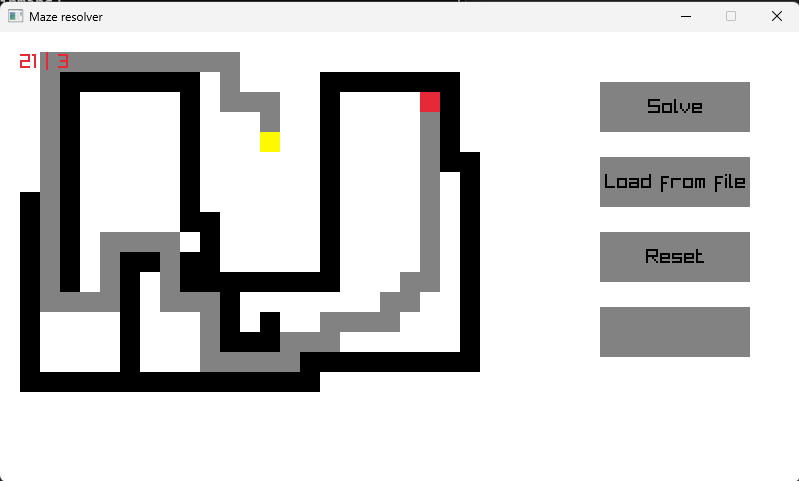

# Maze

Maze is a very simple program designed to solve little mazes created or imported by the user. 

The purpose of this project is practise raylib making my custom GUI components.

## Controls

- `W`: Wall
- `R`: Empty cell
- `S`: Start point
- `E`: End point
- `Left click`: Put the element on the grid

## Setup

1. `conan install .`
2. `cmake -DCMAKE_TOOLCHAIN_FILE=${projectDir}/<build dir>/conan_toolchain.cmake`
